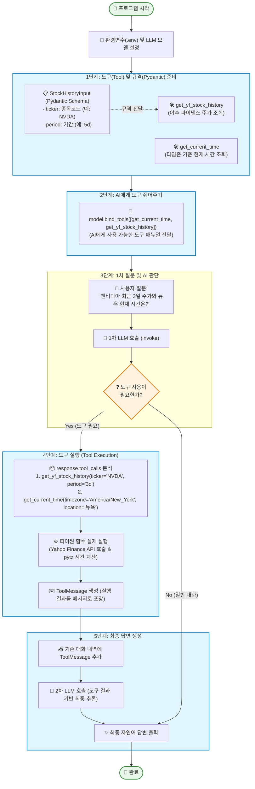
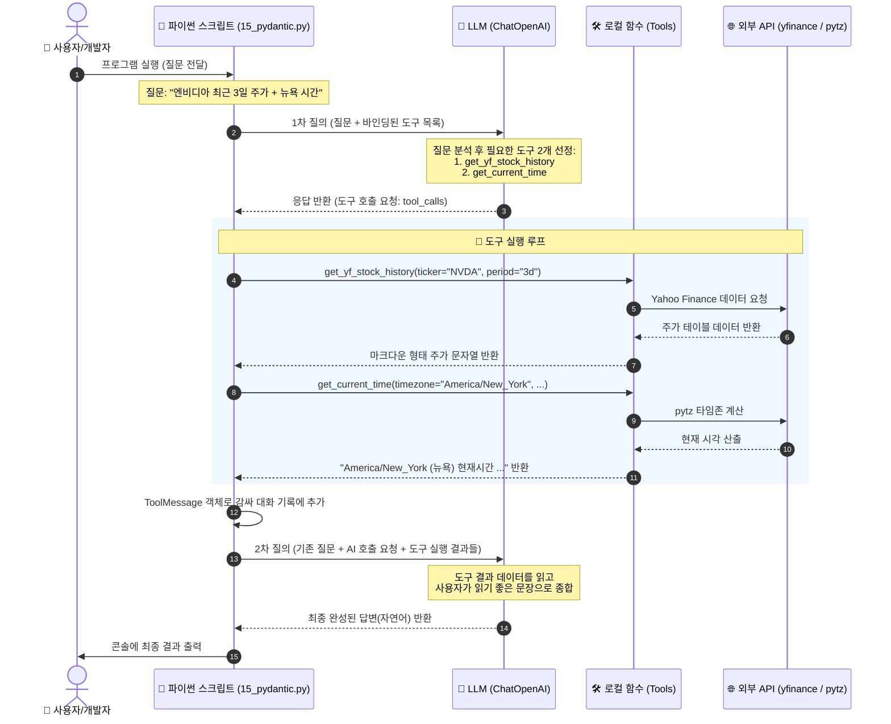

# 📘 초보자를 위한 LangChain & Pydantic Tool Calling 완벽 가이드

이 문서는 [`15_pydantic.py`](file:///c:/workAi/work8/15_pydantic.py) 코드의 전체 동작 원리와 핵심 개념을 초보자의 눈높이에 맞춰 설명합니다.

---

## 🌟 1. 핵심 개념 한눈에 보기 (비유로 이해하기)

AI(LLM)는 똑똑하지만 **최신 주가**나 **현재 시간** 같은 실시간 정보는 알지 못합니다.  
따라서 AI에게 **"도구(계산기, 조회기 등)"**를 쥐어주고 필요할 때 직접 쓰게 만드는 것이 **Tool Calling(도구 호출)**입니다.

| 개념 | 일상 비유 | 코드 내 역할 |
| :--- | :--- | :--- |
| **Pydantic (`BaseModel`)** | **주문서 양식** (필수 항목, 규격 검사) | 도구에 필요한 매개변수의 이름, 타입, 설명을 명시 |
| **Tool (`@tool`)** | **전문가 도구함** (주가 조회기, 시계) | 실제 파이썬 코드가 실행되어 외부 데이터를 가져오는 함수 |
| **Model Binding (`bind_tools`)** | **도구 매뉴얼을 AI에게 전달** | AI가 사용 가능한 도구 목록과 사용법을 알게 됨 |
| **Tool Calling (`tool_calls`)** | AI가 **"이 도구로 이 파라미터 실행해주세요"** 요청 | AI가 함수를 직접 실행하지 못하므로, 사용자/시스템에 실행 요청 |
| **ToolMessage** | **도구 실행 결과표** | 함수 실행 결과를 AI에게 다시 전달하여 최종 답변을 생성 |

---

## 🗺️ 2. 전체 실행 흐름도 (Mermaid Flowchart)



---

## 🔄 3. 상호작용 시퀀스 다이어그램 (Sequence Diagram)

사용자, 파이썬 코드, LLM, 외부 API 간에 데이터가 어떻게 오가는지 순서대로 살펴보겠습니다.



---

## 🧩 4. 코드 파트별 상세 해설

### 1️⃣ Pydantic 스키마 정의 (`StockHistoryInput`)

```python
class StockHistoryInput(BaseModel):
    ticker: str = Field(..., title='주식코드', description='주식 티커 심볼 (예: NVDA, AAPL, MSFT, TSLA)')
    period: str = Field(..., title='기간', description='주식 데이터 조회 기간 (예: 1d, 5d, 1mo, 1y)')
```

- **Pydantic이란?**: 파이썬에서 데이터 타입을 강제하고 유효성을 검증하는 라이브러리입니다.
- **LLM과의 관계**: `Field(..., description="...")`에 적힌 설명문은 그대로 LLM에게 전달됩니다. LLM은 이 설명을 읽고 `"아, ticker에는 'NVDA' 같은 심볼을 넣어야겠구나!"`라고 파악합니다.

---

### 2️⃣ 도구(Tools) 정의

```python
# 방법 A: Pydantic 스키마를 명시적으로 연결
@tool(args_schema=StockHistoryInput)
def get_yf_stock_history(ticker: str, period: str) -> str:
    ...

# 방법 B: 파이썬 Docstring(함수 설명글) 기반 자동 스키마 생성
@tool
def get_current_time(timezone: str, location: str) -> str:
    """현재 시간을 YYYY-MM-DD HH:MM:SS 형식으로 반환하는 함수..."""
    ...
```

- `@tool` 데코레이터를 붙이면 일반 파이썬 함수가 LangChain이 인식할 수 있는 **AI용 도구**로 변환됩니다.
- 함수 내부에서는 `yfinance`로 주가를 가져오거나 `pytz`로 타임존 시간을 계산합니다.

---

### 3️⃣ 도구 바인딩 (`bind_tools`)

```python
tools = [get_current_time, get_yf_stock_history]
tool_dict = {tool_obj.name: tool_obj for tool_obj in tools}

llm_with_tools = model.bind_tools(tools)
```

- `model.bind_tools(tools)`를 호출하면 OpenAI API의 Function Calling 스펙에 맞게 도구 정보(이름, 매개변수, 설명)가 JSON 형태로 LLM에 자동 등록됩니다.
- `tool_dict`: 나중에 AI가 도구 이름을 반환했을 때 바로 함수를 찾아서 실행하기 위한 딕셔너리입니다.

---

### 4️⃣ 실행 및 피드백 루프 (Tool Calling Loop)

```python
response = llm_with_tools.invoke(messages)
messages.append(response)

if response.tool_calls:
    for tool_call in response.tool_calls:
        # 1. AI가 요청한 도구 이름과 인자 확인
        selected_tool = tool_dict.get(tool_call["name"])
        # 2. 실제 파이썬 함수 실행
        tool_result = selected_tool.invoke(tool_call)
        
        # 3. 결과를 ToolMessage로 감싸서 대화에 추가
        tool_msg = ToolMessage(content=str(tool_result), tool_call_id=tool_call["id"])
        messages.append(tool_msg)
    
    # 4. 도구 결과가 추가된 대화 내역 전체를 다시 LLM에 전달
    final_response = llm_with_tools.invoke(messages)
```

1. **1차 호출**: AI는 직접 함수를 실행하지 않고, `"이 함수들을 이 인자값으로 실행해줘"`라는 메타데이터(`tool_calls`)만 돌려줍니다.
2. **함수 실행**: 파이썬 코드가 해당 함수를 실행하고 결과를 얻습니다.
3. **ToolMessage 전달**: 결과를 `ToolMessage`에 담고, 호출 ID(`tool_call_id`)와 매칭합니다.
4. **2차 호출**: AI는 전달받은 실제 데이터를 바탕으로 질문에 맞는 친절하고 완벽한 답변을 작성합니다.

---

## ❓ 자주 묻는 질문 (FAQ)

> **Q. AI가 왜 직접 함수를 실행하지 않고 사용자 코드에게 실행해달라고 하나요?**  
> **A.** LLM은 거대한 언어 생성 모델일 뿐, 사용자의 컴퓨터나 외부 서버(네트워크)에 접근할 권한이 없습니다. 따라서 보안과 안정성을 위해 "어떤 함수를 어떤 인자로 호출해야 하는지"만 JSON 형태로 알려주고, 실제 실행은 클라이언트 프로그램이 담당합니다.

> **Q. Pydantic의 `Field(...)`에서 `...` (Ellipsis)는 무슨 뜻인가요?**  
> **A.** '해당 필드는 필수(Required) 값이다'를 의미합니다. 기본값이 없으므로 AI가 반드시 이 값을 채워서 호출해야 합니다.
