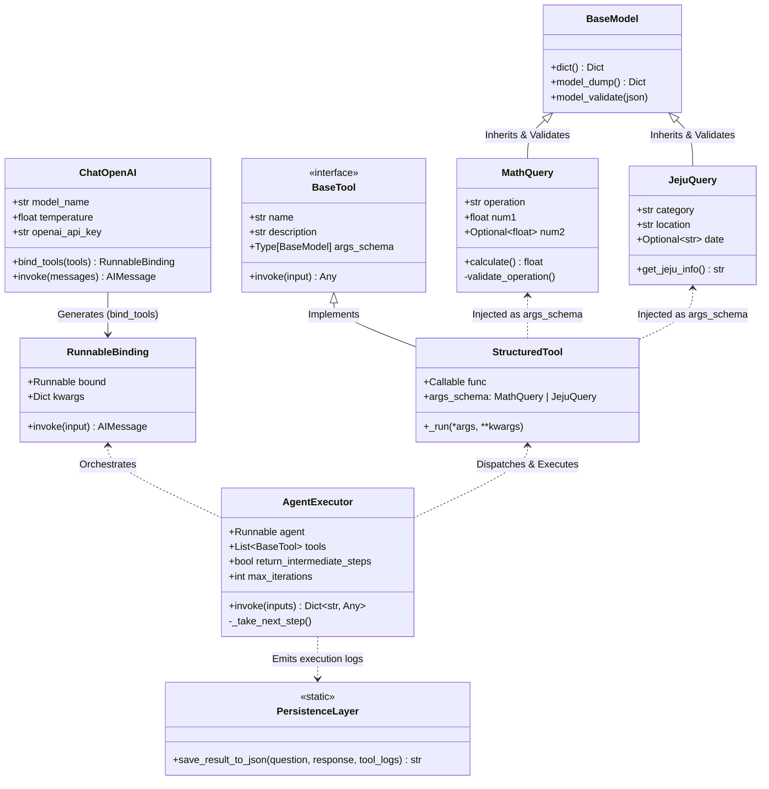
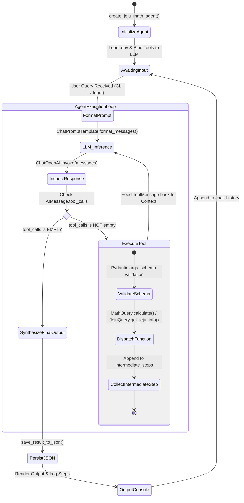
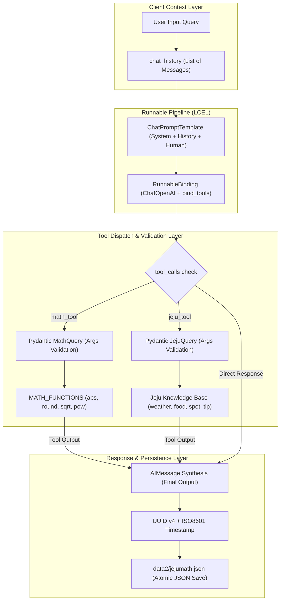

# 🏛️ mymathjeju.py 전문가용 아키텍처 및 내부 메커니즘 분석서 (Expert Technical Specification)

본 문서는 `mymathjeju.py`의 내부 객체 지향 설계, LangChain LCEL(LangChain Expression Language) 실행 런타임, Pydantic v2 메타데이터 직렬화/역직렬화 프로토콜, ReAct(Reasoning + Acting) Agent 루프 및 상태 전이(State Transition)를 **전문 엔지니어 관점에서 상세히 분석한 기술 문서**입니다.

---

## 📐 1. 클래스 및 객체 지향 구조 다이어그램 (Class & Interface Diagram)

Pydantic `BaseModel` 기반의 파라미터 스키마 캡슐화 구조와 LangChain의 `BaseTool` / `RunnableBinding` 추상화 모델입니다.

---

## ⚡ 2. ReAct Agent 실행 엔진 및 상태 전이도 (State Transition Diagram)

`AgentExecutor` 내부의 ReAct(Reasoning + Acting) 추론 루프와 도구 디스패치 사이클을 나타냅니다.

---

## 🧬 3. LCEL 런타임 및 데이터 파이프라인 (Dataflow Architecture)

LangChain Expression Language(`prompt | model_with_tools`) 런타임의 데이터 흐름과 입출력 직렬화 계층입니다.

---

## 🔬 4. 주요 아키텍처 특징 및 엔지니어링 포인트

1. **Pydantic v2 기반 Type Safety & Input Coercion**:
   - `MathQuery`, `JejuQuery`가 단순 딕셔너리가 아닌 정적 타입 검증 객체로 선언되어, LLM이 잘못된 인자 형식을 전달했을 때 런타임 유효성 검사 에러를 포착하고 자동 교정을 유도합니다.
2. **함수형 딕셔너리 디스패치 패턴 (`MATH_FUNCTIONS`)**:
   - `eval()` 같은 취약한 동적 코드 실행 방식을 완전히 배제하고, 화이트리스트 기반의 `MATH_FUNCTIONS` 딕셔너리 매핑을 통해 안전한 연산 환경을 보장합니다.
3. **ReAct 다중 턴 추론 및 Intermediate Steps**:
   - 복합 질문(예: `sqrt(144) 계산해주고 서귀포 맛집 추천해줘`) 인입 시 LLM이 `math_tool`과 `jeju_tool`을 순차적/병렬적으로 호출하여 중간 로그(`intermediate_steps`)를 수집한 후 최종 결합 응답을 생성합니다.
4. **I/O 원자적 파일 영속성 (`save_result_to_json`)**:
   - `uuid4` 기반 식별자와 ISO8601 타임스탬프를 부여하여 `data2/jejumath.json`에 일관된 감사 로그(Audit Log)를 유지합니다.
