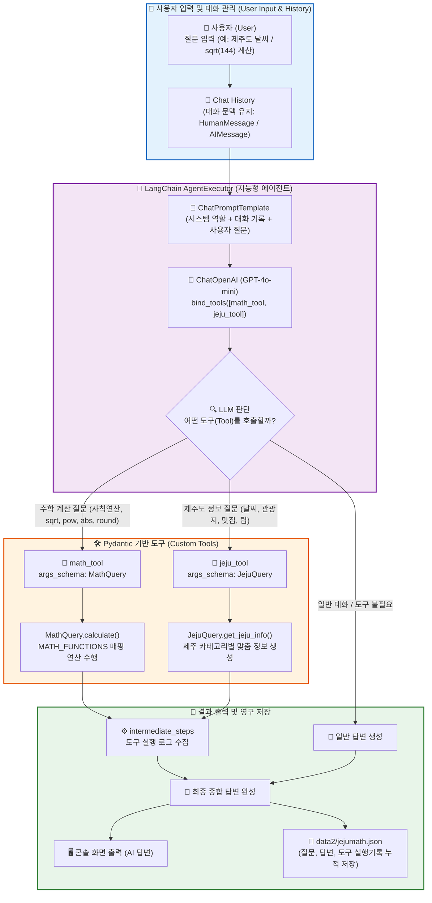
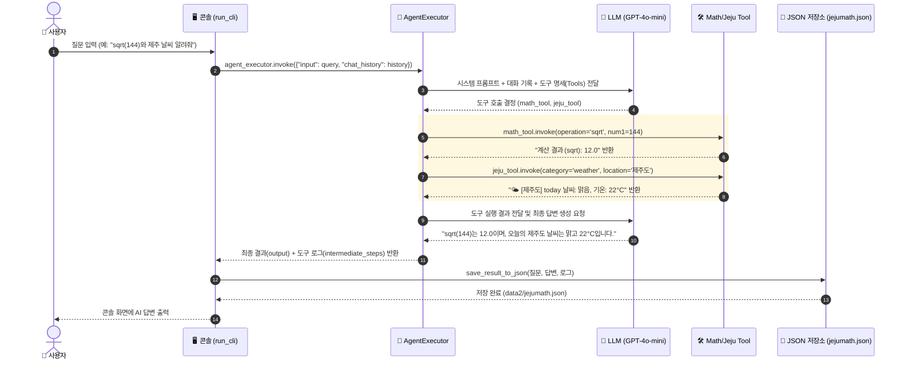

# 🍊 mymathjeju.py 파이프라인 구조도 및 초보자 가이드 (Beginner's Guide)

이 문서는 `mymathjeju.py` 코드의 전체적인 작동 원리와 구조를 초보자도 한눈에 쉽게 이해할 수 있도록 **Mermaid 다이어그램**과 단계별 상세 설명으로 정리한 문서입니다.

---

## 💡 1. 한눈에 보는 전체 시스템 구조도 (System Architecture)

`mymathjeju.py`는 **사용자 질문(CLI)**, **AgentExecutor(지능형 에이전트)**, **Pydantic 기반 도구(Math & Jeju Tools)**, 그리고 **JSON 파일 영구 저장소**가 유기적으로 작동하는 LangChain 에이전트 프로그램입니다.



---

## 🧩 2. 핵심 구성 요소별 상세 설명 (Core Components)

### 1️⃣ 수학 내장함수 매핑 (`MATH_FUNCTIONS`)
* **역할**: 파이썬 표준 라이브러리의 내장 함수(`abs`, `round`) 및 `math` 모듈의 고급 함수(`sqrt`, `pow`)를 딕셔너리로 매핑하여 안전하고 정확하게 계산을 수행합니다.
* **지원 함수**:
  * `abs` : 절대값 계산 (두 수의 차이 계산도 지원)
  * `round` : 반올림 (자릿수 지정 가능)
  * `sqrt` : 제곱근 계산 (음수 방어 로직 포함)
  * `pow` : 거듭제곱 연산

### 2️⃣ Pydantic 데이터 검증 스키마 (`MathQuery`, `JejuQuery`)
* **역할**: AI 모델(LLM)이 도구를 호출할 때 넘겨줄 인자의 **데이터 타입과 유효성(Validation)**을 검사합니다.
* **주요 클래스**:
  * `MathQuery`: `operation`(연산 종류), `num1`(첫 번째 수), `num2`(두 번째 수)를 받아 `calculate()`로 계산
  * `JejuQuery`: `category`(weather, tourist_spot, food, tip), `location`(세부 지역), `date`(날짜)를 받아 `get_jeju_info()`로 안내문 생성

### 3️⃣ LangChain 도구 등록 (`@tool(args_schema=...)`)
* **역할**: 파이썬 함수를 AI가 직접 호출할 수 있는 `Tool` 형태로 등록합니다.
* `math_tool` : 사칙연산(`add`, `subtract`, `multiply`, `divide`) 및 수학 함수 처리
* `jeju_tool` : 제주도 맞춤형 정보(날씨, 여행지, 음식, 팁) 제공

### 4️⃣ 지능형 에이전트 초기화 (`create_jeju_math_agent`)
* **역할**: `ChatOpenAI`(GPT-4o-mini)에 등록된 도구 목록을 바인딩(`bind_tools`)하고, 프롬프트 템플릿과 결합하여 스스로 판단하고 실행하는 `AgentExecutor`를 생성합니다.
* **특징**: `return_intermediate_steps=True` 옵션을 통해 어떤 도구가 어떤 파라미터로 실행되었는지 중간 추론 과정을 투명하게 기록합니다.

### 5️⃣ 결과 누적 저장 (`save_result_to_json`)
* **역할**: 사용자의 질문, AI의 답변, 사용된 도구의 세부 로그(`tool_logs`), 실행 시각, 고유 ID(UUID)를 `data2/jejumath.json` 파일에 JSON 포맷으로 누적 저장합니다.

---

## 🔄 3. 데이터 흐름 순서도 (Sequence Diagram)

사용자가 질문을 입력했을 때 시스템 내부에서 일어나는 처리 과정입니다:



---

## 🚀 4. 실행 방법 (Quick Start)

가상환경(`.venv`)이 활성화된 터미널에서 다음 명령어를 실행합니다:

```powershell
python mymathjeju.py
```

### 💡 질문 예시
1. **제주 정보 조회**: `제주도 서귀포 맛집과 성산일출봉 관광 팁 알려줘`
2. **복합 수학 계산**: `abs(2 - 17) 계산해줘`
3. **거듭제곱 및 제곱근**: `sqrt(256)과 pow(2, 10) 계산해줘`
4. **소수점 반올림**: `round(3.141592, 3) 계산해줘`
