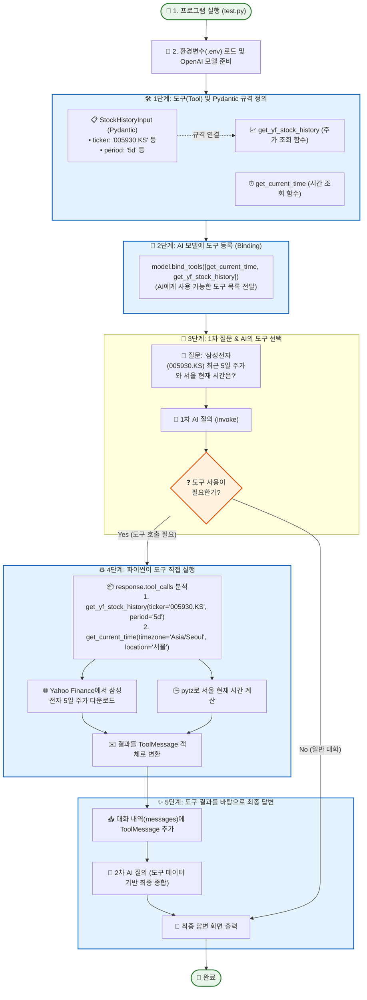
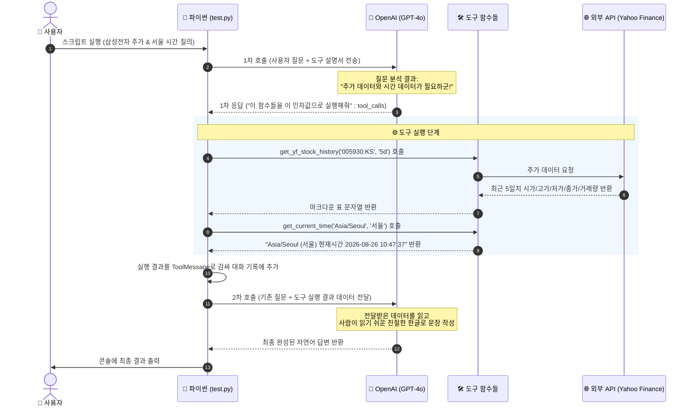

# 📘 [초보자 완벽 가이드] `test.py` 동작 원리 & Mermaid 구조도

이 문서는 [`test.py`](file:///c:/workAi/work8/test.py) 코드가 어떻게 동작하는지 초보자도 한눈에 이해할 수 있도록 **핵심 비유**, **3종 Mermaid 다이어그램**, **코드 1:1 상세 해설**로 정리한 문서입니다.

---

## 🌟 1. 핵심 개념: AI에게 "도구(Tool)" 쥐어주기

> **💡 왜 Tool Calling(도구 호출)이 필요한가요?**  
> AI(ChatGPT 등)는 똑똑하지만 **'오늘 실시간 주가'**나 **'지금 몇 시인지'**는 모릅니다.  
> 따라서 사람이 AI에게 **"주가 조회기"**와 **"시계"**라는 도구를 건네주고, AI가 질문을 받으면 스스로 **"이 도구로 데이터를 가져와 줘!"**라고 요청하게 만드는 기술입니다.

| 개념 | 일상 비유 | `test.py` 코드 역할 |
| :--- | :--- | :--- |
| **`StockHistoryInput` (Pydantic)** | 📋 **주문서 양식** | 도구에 필요한 매개변수(종목코드, 기간)의 규칙과 설명 정의 |
| **`get_yf_stock_history` (`@tool`)** | 📈 **주가 조회기** | Yahoo Finance에서 실제 주가 데이터를 긁어오는 함수 |
| **`get_current_time` (`@tool`)** | ⏰ **세계 시계** | 특정 도시(타임존)의 현재 시각을 계산하는 함수 |
| **`bind_tools`** | 📖 **도구 사용설명서 전달** | AI에게 어떤 도구들이 있는지 알려주는 과정 |
| **`tool_calls`** | 🗣️ **"이 도구 실행해줘!" 요청** | AI가 직접 코드를 실행할 수 없으므로 파이썬에 실행 요청 |
| **`ToolMessage`** | 📊 **도구 실행 결과 보고서** | 파이썬이 실행한 주가/시간 결과를 AI에게 다시 전달 |

---

## 🗺️ 2. 전체 실행 플로우차트 (Flowchart)



---

## 🔄 3. 데이터 송수신 시퀀스 다이어그램 (Sequence Diagram)



---

## 🧩 4. 코드 4대 핵심 구조 상세 해설

### 1️⃣ Pydantic 스키마 (`StockHistoryInput`)
```python
class StockHistoryInput(BaseModel):
    ticker: str = Field(..., title='주식코드', description='주식 티커 심볼 (예: 005930.KS(삼성전자), NVDA, AAPL, MSFT, TSLA)')
    period: str = Field(..., title='기간', description='주식 데이터 조회 기간 (예: 1d, 5d, 1mo, 1y)')
```
- **Pydantic의 역할**: AI가 함수를 호출할 때 엉뚱한 값을 넣지 못하도록 **타입(str)과 필수 입력 여부(`...`)**를 강제합니다.
- `description`에 적힌 설명문은 AI에게 그대로 전달되어 AI가 `"아, 삼성전자는 '005930.KS'로 입력해야 하는구나!"`라고 학습하게 됩니다.

---

### 2️⃣ 도구 정의 (`@tool`)
```python
@tool(args_schema=StockHistoryInput)
def get_yf_stock_history(ticker: str, period: str) -> str:
    """주식 종목의 가격 데이터(시가, 종가, 고가, 저가, 거래량 등)를 조회하는 함수"""
    stock = yf.Ticker(ticker=ticker)
    history = stock.history(period=period)
    return history.to_markdown()
```
- 일반 파이썬 함수 위에 `@tool` 데코레이터를 붙이면 LangChain의 AI 도구로 변환됩니다.
- 함수 내부에서는 `yfinance` 라이브러리를 통해 실제 미국/한국 주식 시장의 데이터를 가져옵니다.

---

### 3️⃣ 도구 바인딩 (`model.bind_tools`)
```python
tools = [get_current_time, get_yf_stock_history]
tool_dict = {tool_obj.name: tool_obj for tool_obj in tools}

llm_with_tools = model.bind_tools(tools)
```
- `bind_tools`를 사용하면 AI에게 2가지 도구의 이름, 설명, 매개변수 규격을 JSON 포맷으로 묶어 등록합니다.

---

### 4️⃣ 도구 실행 및 답변 완성 루프 (Loop)
```python
response = llm_with_tools.invoke(messages)
messages.append(response)

if response.tool_calls:
    for tool_call in response.tool_calls:
        # 1. AI가 요청한 도구를 찾아 실행
        selected_tool = tool_dict.get(tool_call["name"])
        tool_result = selected_tool.invoke(tool_call)
        
        # 2. 실행 결과를 ToolMessage에 담아 대화 내역에 추가
        tool_msg = ToolMessage(content=str(tool_result), tool_call_id=tool_call["id"])
        messages.append(tool_msg)
    
    # 3. 도구 결과가 추가된 전체 대화로 최종 답변 생성
    final_response = llm_with_tools.invoke(messages)
```
- **1차 질의**: AI는 텍스트 답변 대신 `"이 도구들을 실행해줘"`라는 요청(`response.tool_calls`)을 반환합니다.
- **파이썬 실행**: 파이썬이 실제로 함수를 돌려 결과 데이터를 획득합니다.
- **2차 질의**: 결과 데이터를 보고 AI가 완벽한 문장으로 최종 요약하여 응답합니다.

---

## ❓ 초보자가 자주 묻는 질문 (FAQ)

> **Q1. AI가 직접 주가를 가져오면 안 되나요?**  
> AI는 텍스트를 읽고 쓰는 두뇌일 뿐, 인터넷 브라우저나 프로그램을 직접 켤 수 있는 손발(권한)이 없습니다. 그래서 파이썬 프로그램이 손발이 되어 대신 데이터를 가져와 주는 것입니다.

> **Q2. 한국 주식 코드는 왜 뒤에 `.KS`가 붙나요?**  
> Yahoo Finance에서 한국 코스피 종목은 `종목코드.KS` (예: `005930.KS`), 코스닥 종목은 `종목코드.KQ` (예: `035720.KQ`) 형태로 구분하기 때문입니다.
